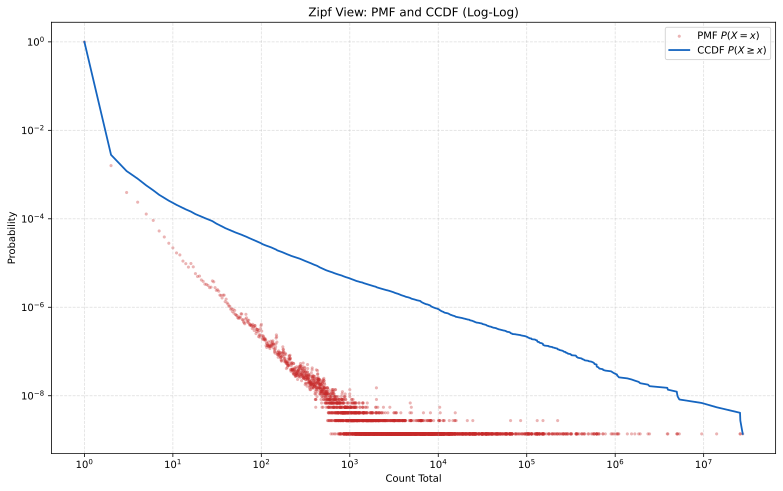

# architecture
rocksdb stores `hash` -> `[u64 idx][data]`

Idx is monotonically increasing, no reuse. Watermark is saved on snapshot.

Counters form zipfianish distribution. The 1..255 range accounts for
729295951 / (729295951 + 9551) counters = 99.998690% (remaining: 0.001310%).

Counters are stored in 3 tiers.

## Tier 1:
Counters for cells with single count are not stored at all.
If a KV record exists (`hash -> [n][data]`) and idx n is absent in counter storage, then the counter is 1.
If a KV record is absent than counter is - eg first insert.

## Tier 2:
Counters for 2..256 are stored in roaring bitsets.

- B0 = ids where bit0 of (rc-1) is 1
- B1 = ids where bit1 of (rc-1) is 1
- ..
- B7 = ids where bit7 of (rc-1) is 1

(-1 because 1 is not stored).

To get idx counter, check membership in B0..B7 and reconstruct it from bits.

### Example

For `idx = 1337`, `rc = 4`:
`v = 4 - 1 = 3 = 0b00000011`.
So `1337` is in `B0` and `B1`, and not in `B2..B7`.
Reconstruct: `v = 1 + 2 = 3`, then `rc = v + 1 = 4`.

## Tier 3
For counters > 256 simply use a `HashMap<u64, u64>`.

In TON state there are 9551 such counters.

## Write flow

* Let `v = rc - 1` for small tier
* Read old `rc` (from Big or bitmaps or implicit-one/zero)
* Compute `new_rc = old_rc + delta`
* Write back:

  * `new_rc == 0`: remove from Big and all bitmaps
  * `new_rc == 1`: remove from Big and all bitmaps (implicit-one)
  * small tier: update bits for `new_v = new_rc - 1`
  * big tier: `Big[idx] = new_rc`, and remove from all bitmaps

Only touch bitmaps whose bit changed:
* `old_v` and `new_v`
* `diff = old_v XOR new_v`
* for each set bit in `diff`, insert/remove in `B[bit]`

Because we have zipf distr most updates will be scattered around implicit 1 and 1 bitset.

## Persistence:

### Header:

* magic/version
* snapshot block `H`
* `next_idx` (so idx assignment continues after restart)

### Body:
* Serialized roaring bitmaps 0..7; length prefixed
* Serialized hashmap KV pairs as single blob, no arbitrary order, prefixed with len.

Atomicity:

* write `counters.H.tmp`
* fsync
* rename to `counters.H.bin`
* keep the previous snapshot, retain older ones

### Restart

* restore rocksdb to the same snapshot height
* load `counters.H.bin` into bitset + hashmaps
* replay blocks `H+1..tip` to rebuild both state and counters
