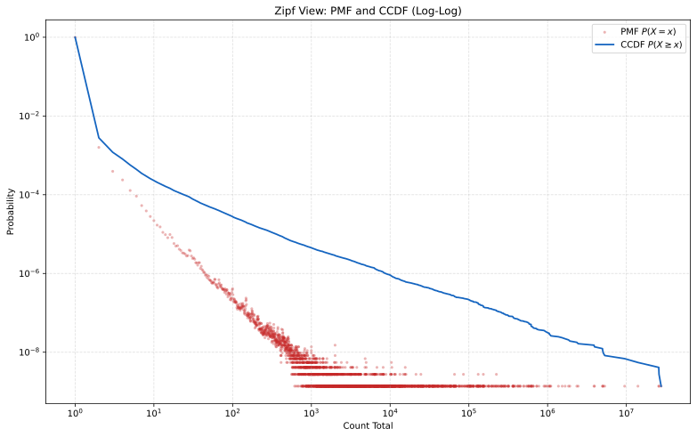

# architecture

rocksdb stores `hash` -> `[u64 idx][data]`

Idx is monotonically increasing, no reuse. Watermark is saved on snapshot.

Counters form zipfianish distribution. In the sampled state:

- `rc = 1`: 727267730 counters = 99.720584%.
- `2 <= rc <= 256`: 2028274 counters = 0.278110%.
- `rc > 256`: 9525 counters = 0.001306%.

Counters are stored in 3 tiers.

## Tier 1:

Counters for cells with single count are not stored at all.
If a KV record exists (`hash -> [n][data]`) and idx n is absent in counter storage, then the counter is 1.
If a KV record is absent than counter is - eg first insert.

## Tier 2:

Counters for 2..256 are stored in roaring bitsets.

- B0 = ids where bit0 of (rc-1) is 1
- B1 = ids where bit1 of (rc-1) is 1
- ..
- B7 = ids where bit7 of (rc-1) is 1

(-1 because 1 is not stored).

To get idx counter, check membership in B0..B7 and reconstruct it from bits.

### Example

For `idx = 1337`, `rc = 4`:
`v = 4 - 1 = 3 = 0b00000011`.
So `1337` is in `B0` and `B1`, and not in `B2..B7`.
Reconstruct: `v = 1 + 2 = 3`, then `rc = v + 1 = 4`.

## Tier 3

For counters > 256 simply use a `HashMap<u64, u64>`.

In TON state there are 9525 such counters.

## Write flow

- Let `v = rc - 1` for small tier
- Read old `rc` (from Big or bitmaps or implicit-one/zero)
- Compute `new_rc = old_rc + delta`
- Write back:
  - `new_rc == 0`: remove from Big and all bitmaps
  - `new_rc == 1`: remove from Big and all bitmaps (implicit-one)
  - small tier: update bits for `new_v = new_rc - 1`
  - big tier: `Big[idx] = new_rc`, and remove from all bitmaps

Only touch bitmaps whose bit changed:

- `old_v` and `new_v`
- `diff = old_v XOR new_v`
- for each set bit in `diff`, insert/remove in `B[bit]`

Because we have zipf distr most updates will be scattered around implicit 1 and 1 bitset.

## Nursery

The Nursery mechanism operates as follows:

For each new insert (cell hash + data), we attach a tag representing the referenced Masterchain block round and store the entry in a temporary map. Before the entry is published to this map, the same data is appended to the Write-Ahead Log (WAL). During normal state storage, every new block carries its referenced Masterchain round.

When garbage collection occurs, short-lived cells are removed from the nursery before they reach RocksDB. Consequently, data that persists for only a few blocks is written only to the WAL and the in-memory map, keeping the overall write traffic to ≈ 1x + 32 bytes for removes. A cell is promoted to RocksDB after it survives 100 rounds.

Overall, these two mechanisms reduce the write amplification due to compaction from 800 GiB down to 200 MiB for a deployment of 10M accounts.
